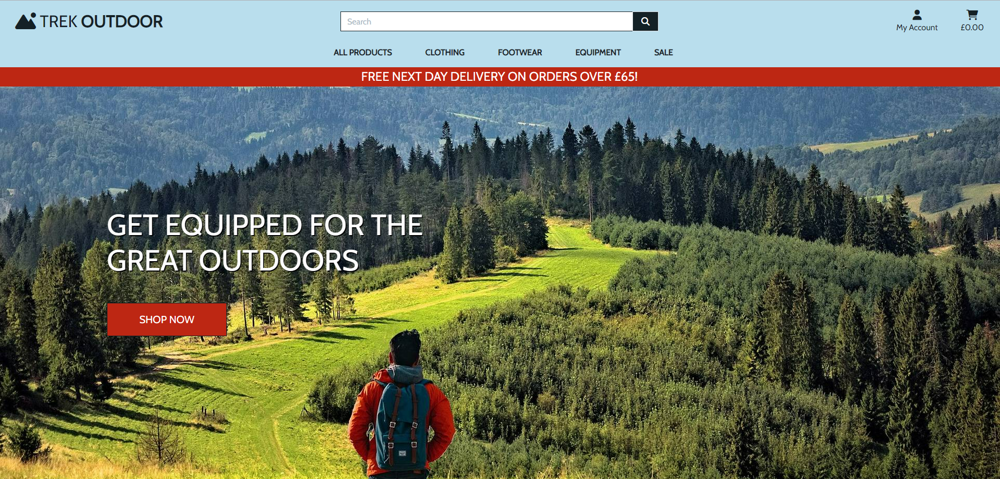
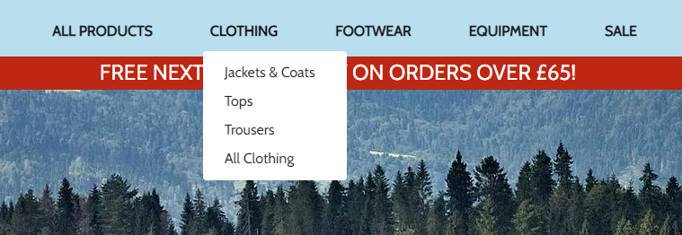
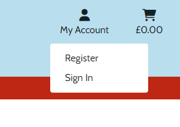
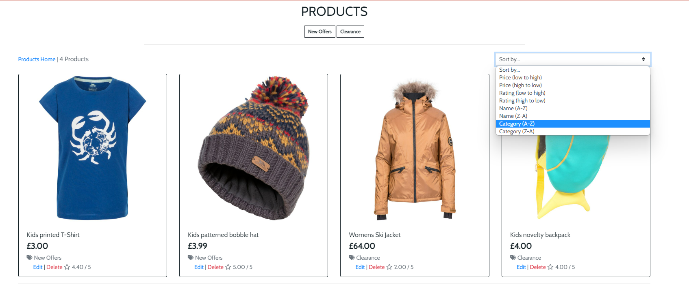
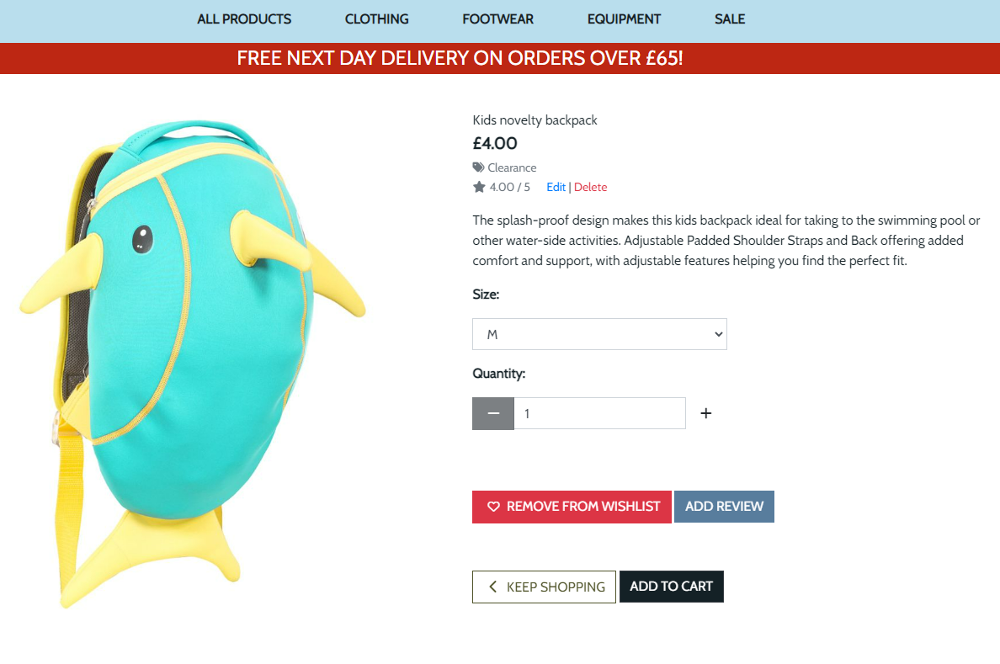
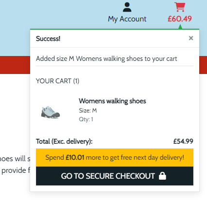
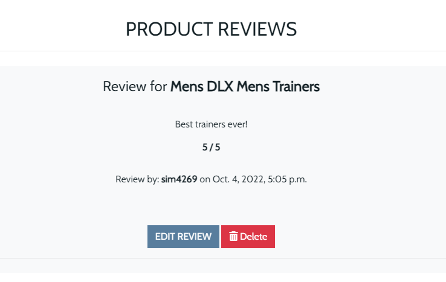
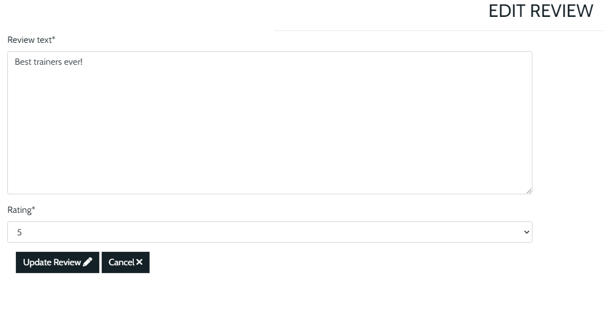

# Trek Outdoor

View the deployed site [here:](https://simgriff-trek-outdoor.herokuapp.com/)
## User Experience (UX)

---

## Introduction
Trek Outdoor is a fictional e-commerce website that I created for my Milestone Project 4. The main goal of this project is to sell outdoor pursuits clothing and equipment, the site is for educational purposes only, however, it is fully functional as an e-commerce website.

The checkout functionality is set up to accept stripe payments. **Please don't enter your personal card details.**
To process a test stripe payment, please use the following details.
* Card number : 4242 4242 4242 4242
* Date: Any future date
* CVC: Any 3 numbers

---

## User Stories
- As an unregistered user, I want to
    1. View a list of products
    2. View details of individual products
    3. View any deals or offers
    4. See the total value of my purchases at any time
    5. Sort the list of available products
    6. Sort a specific category of product
    7. Search a product by name or description
    8. See my search results
    9. Register for an account
    10. Select the size and quantity of a product when purchasing
    11. View items in my shopping cart
    12. Change the quantity of items or remove items from my cart
    13. Enter my payment information
    14. Feel that my personal details and payment information are secure
    15. View order confirmation after checkout

* As a registered user, I want to
    1. Have the same access to functionality as the unregistered user
    2. Be able to Sign In or logout
    3. Reset my password if I forget it
    4. Receive a confirmation email once registered
    5. Have my own personalised user profile
    6. Save my personal information and be able to edit if needed
    7. Review products that I have purchased
    8. Edit and delete my reviews
    9. Add items to my wishlist
    10. Put Wishlist items into my shopping cart
    11. Receive an email confirmation after successfully completing an order at checkout

- As a Site owner/Admin, I want to
    1. Have the same access to functionality as the registered user
    2. Add a product.
    3. Edit a product.
    4. Delete a product.
       
---

## Features
### Home Page

* General
  - The Hero image covers the home page completely except for the Navigation section at the top of the page. The image draws the user in and invites the user into the site with a beautiful picture of the great outdoors.
  - The site Logo appears on the top left of the page within the navbar.

* Navigation

  - The Navbar appears on all pages throughout the site. The site logo appears on the left and is read by the user first, reading left to right, top to bottom. 
  - Navigation links are also displayed for each product category with drop-down menus displaying all the available subcategories. 
Categories and sub-categories
  * All Products
     - By Price
     - By Category
     - By Rating
     - All Products
  * Clothing
     - Jackets
     - Tops
     - Trousers
     - All clothing
  * Footwear
     - Shoes
     - Boots
     - Sandals
     - Accessories
     - All Footwear
  * Equipment
     - Hiking
     - Climbing
     - Cycling
     - Swimming
     - Camping
     - Skiing
     - All Equipment
  * Sale
     - New offers
     - Clearance
     - All Sale items

* Search feature
  - The search bar is centred at the top of the page allowing the user to search for products by entering a keyword.

* Main Site Icons

  - Fontawesome icons are shown at the top of the page representing ‘My Account’, ‘Wishlist’ and the Shopping Cart. There is a further drop-down option under ‘My Account’ for ‘Sign In’ and ‘Register’.
 * Shop Now button
  - This button is presented on the main page and takes the user directly into the ‘All Products’ section.

### Products Page

* The Products page displays relevant products displayed on individual cards. The number of products is displayed in the top left of the section with a link to the home page next to this.
* Products can be sorted by Price, Rating, Name and Category with a drop-down selector on the right side of the page. 
* Admin also have access to two further buttons to delete or update a product.

### Product Details Page

* Features the product image on the left.
* Product details displayed on right side of image, including product name, description, price, category and rating.
* When user signed in, a white heart icon is displayed on bottom right of image that enables signed add product to their wishlist. The heart icon changes to green once selected, it can be removed by selected once again.
* Quantity selector allows user to select required number of products.
* Add to Cart button adds product to users shopping cart, shopping cart icon at top of page is updated with the relevant amount. 
* Feedback provided to shopper via a popup from Bootstrap toasts, informing the user that item has been added with a link to the shopping cart page.

* Admin also have access to two further buttons to delete or update a product.
* Reviews - Any product reviews are listed underneath the product card. A signed in user has the option to edit or delete any reviews they have added via the two buttons beneath the review that are only available to the user that created the review, or admin.

  - Edit – User is taken to the Edit Review form and asked to confirm any changes.

  - Delete – Once selected, a Delete confirmation modal is displayed to safeguard against accidental deletion.
  - If the user has not added a review yet, the Add Review button is displayed and the user is taken to the Add Review Form.
* Add/Edit Review Page 
- [Add Review Form](static/images/screenshots/add-review-form.png)
- [Edit Review Form](static/images/screenshots/edit-review-form.png)

### Wishlist
- [Wishlist Page](static/images/screenshots/wishlist-page.png)
* Displays all products added to users wishlist. Products are displayed in the same format as the main products page with the same functionality. 
* Each product in the wishlist also has a quantity selector and an add to cart button enabling the user to easily add their wishlist items to the shopping cart.
* Once heart icon selected feedback provided to shopper via a popup from Bootstrap toasts, informing the user that item has been added to their wishlist.
* A remove link is shown at the bottom of the product card so that a product can be easily removed from their wishlist.

* Shopping Cart Success Pop up
- [Shopping Cart Success](static/images/screenshots/shopping-cart-success.png)

### Shopping Cart
- [Shopping Cart Page](static/images/screenshots/shopping-cart-page.png)
  - Each product selected by the shopper is listed along with an image, Name of product, size (if applicable), SKU code and price.
  - The shopper can adjust the quantity of an individual product in the cart or remove it completely.
  - At the bottom of the listed products in the cart is a Cart Total, Delivery Charge (if applicable) and Grand total.
  - The shopper is given two option buttons under the grand total, to Keep Shopping or go to the Secure Checkout.

### Checkout Page
- [Checkout Page](static/images/screenshots/checkout-page.png)
  - Shipping and payment information form shown on the left
  - Allows user to save information if signed in. If not signed in, Create an account or Sign in to save this information message is presented with the appropriate link.
- [Order Success](static/images/screenshots/order-success.png)
  - Once order submitted success message displayed with order summary, email order confirmation also sent to user’s email address
  - On the left of the page products in the cart are listed, providing a product image, product name, size (if applicable), quantity and price. 
  - Under the listed products is an Order Total, Delivery Charge (if applicable) and Grand total.
### Admin Product Management
- [Add Product Form](static/images/screenshots/add-product-form.png)
  - Add product form displayed to add a new item to the store
- [Edit Product Form](static/images/screenshots/edit-product-form.png)
  - Admin can also edit and delete existing products, every product displays edit/delete at bottom of item summary. Delete confirmation is also displayed to safeguard against accidental deletion
- [Delete Confirmation](static/images/screenshots/delete-confirmation.png)

### Allauth features
The sign in, register, password reset, email confirmation pages etc, have all been provided by Django allauth and formatted to meet the needs of the site.

---

### Future features
* Adding stock management for the products.
* Add more payment options, Paypal, Apple Pay etc.
* Allow the site to recommend products to the shopper based on their order history.

---
## Database Design
### Database Schema
The Database Schema below was produced using [Lucidchart]( https://www.lucidchart.com/)

### Models
* User model
  - Created with django allauth and contains the customer username, email and password.
* User Profile model
  - Holds users default delivery information and order history.
* Category model
  - Holds all main category names for a product.
* Subcategory model
  - Holds subcategory names for a product.
* Products model
  - Holds detailed information for each individual product.
* Wishlist model
  - Signed in user can select any items they wish to place into a wishlist. 
  - Items can be easily removed from the wishlist.
  - Items can be added to the shopping cart directly from the wishlist
* Order model
  - Holds all information relating to a customer’s completed order.
  - Allows the user to view their previous orders.
* OrderLineItem model
  - Holds information of an individual product that has been purchased.

* Review model
  - Holds reviews added for a specified product. Displays username that left the review along with time/date.

---

## Design
### Colour Scheme
I used [Coolors](https://coolors.co/) to generate a colour scheme from my chosen hero image. I selected two colours from the palette that complement each other. The colours represent the earthly natural colours of the great outdoors. The Colour palette includes Light Blue #B9DEED background on the home page with overlayed text in Charleston Green #142126, this  ensure excellent readability. The Charleston Green #142126 text was used throughout the site and stood out well against the white background.

---

### Typography
I used [Google Fonts](https://fonts.google.com/) to import the fonts used for this site. 
I chose the __ Cabin __ font as it is a very clear and legible typeface. I felt that this font gave off a friendly vibe and worked well with my e-commerce site.

---

### Imagery
The main hero image on the landing page is taken from pixabay [pixabay.com]( https://pixabay.com/) with a Free to use license. The eye catching outdoor image draws the user in and helps convey the purpose of the e-commerce site.
The mountains logo from [Font Awesome](https://fontawesome.com/) was used to give the site name more of a visual impact. Fontawesome icons were also used throughout the site, the icons help inform the user of the purpose of a particular section and lead to a more enjoyable user experience. 
Include screenshots of logo and 

All product images have been downloaded from [sportpersuit.com](https://www.sportpursuit.com/) e-commerce store.

---

## Wireframes

The wireframes for the Bookworm site were produced using Balsamiq. 
* Mobile Wireframes:
  - [Home](static/images/wireframes/home-mobile.png)
  - [Products](static/images/wireframes/products-mobile.png)
  - [Product Details](static/images/wireframes/product-details-mobile.png)
  - [Add Review](static/images/wireframes/add-review-mobile.png)
  - [Wishlist](static/images/wireframes/wishlist-mobile.png)
  - [Shopping Cart](static/images/wireframes/shopping-cart-mobile.png)
  - [Checkout](static/images/wireframes/checkout-mobile.png)
  - [My Account](static/images/wireframes/my-account-mobile.png)
  - [Sign In](static/images/wireframes/sign-in-mobile.png)
  - [Register](static/images/wireframes/register-mobile.png)
  - [Add Products](static/images/wireframes/add-products-mobile.png)
  
* Desktop Wireframes:
  - [Home](static/images/wireframes/home-desktop.png)
  - [Products](static/images/wireframes/products-desktop.png)
  - [Product Details](static/images/wireframes/product-details-desktop.png)
  - [Add Review](static/images/wireframes/add-review-desktop.png)
  - [Wishlist](static/images/wireframes/wishlist-desktop.png)
  - [Shopping Cart](static/images/wireframes/shopping-cart-desktop.png)
  - [Checkout](static/images/wireframes/checkout-desktop.png)
  - [My Account](static/images/wireframes/my-account-desktop.png)
  - [Sign In](static/images/wireframes/sign-in-desktop.png)
  - [Register](static/images/wireframes/register-desktop.png)
  - [Add Products](static/images/wireframes/add-products-desktop.png)

---
