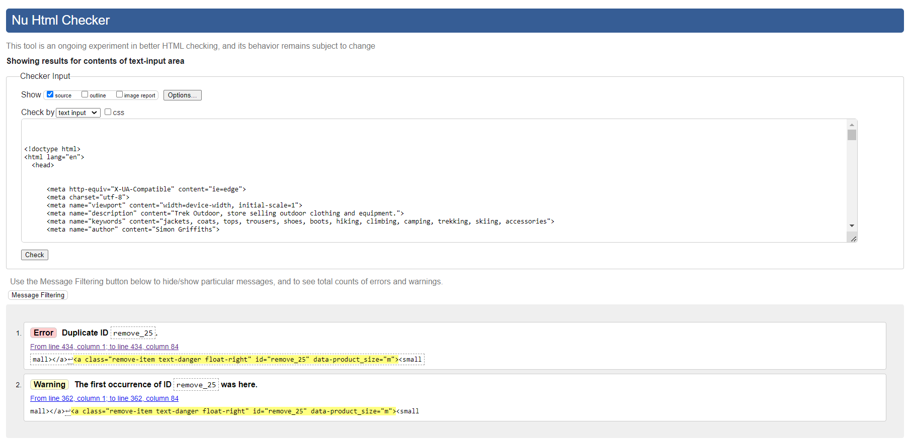
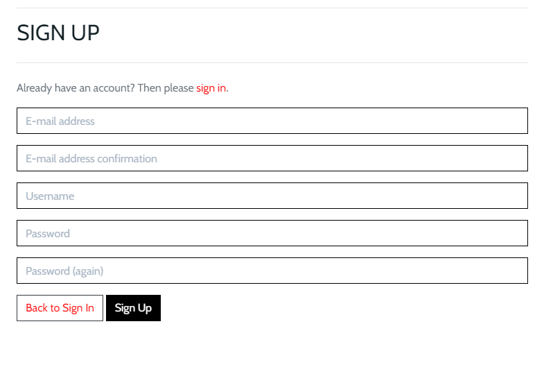
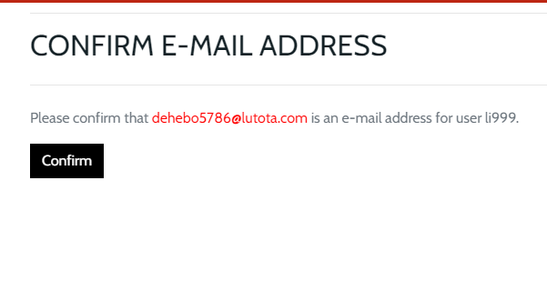
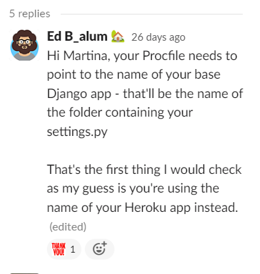

# Trek Outdoor

View the deployed site [here:](https://simgriff-trek-outdoor.herokuapp.com/)
## User Experience (UX)

---

## Introduction
Trek Outdoor is a fictional e-commerce website that I created for my Milestone Project 4. The main goal of this project is to sell outdoor pursuits clothing and equipment, the site is for educational purposes only, however, it is fully functional as an e-commerce website.

The checkout functionality is set up to accept stripe payments. **Please don't enter your personal card details.**
To process a test stripe payment, please use the following details.
* Card number : 4242 4242 4242 4242
* Date: Any future date
* CVC: Any 3 numbers

---

## User Stories
- As an unregistered user, I want to
    1. View a list of products
    2. View details of individual products
    3. View any deals or offers
    4. See the total value of my purchases at any time
    5. Sort the list of available products
    6. Sort a specific category of product
    7. Search a product by name or description
    8. See my search results
    9. Register for an account
    10. Select the size and quantity of a product when purchasing
    11. View items in my shopping cart
    12. Change the quantity of items or remove items from my cart
    13. Enter my payment information
    14. Feel that my personal details and payment information are secure
    15. View order confirmation after checkout

* As a registered user, I want to
    1. Have the same access to functionality as the unregistered user
    2. Be able to Sign In or logout
    3. Reset my password if I forget it
    4. Receive a confirmation email once registered
    5. Have my own personalised user profile
    6. Save my personal information and be able to edit if needed
    7. Review products that I have purchased
    8. Edit and delete my reviews
    9. Add items to my wishlist
    10. Put Wishlist items into my shopping cart
    11. Receive an email confirmation after successfully completing an order at checkout

- As a Site owner/Admin, I want to
    1. Have the same access to functionality as the registered user
    2. Add a product.
    3. Edit a product.
    4. Delete a product.
       
---

## Features
### Home Page

* General
  - The Hero image covers the home page completely except for the Navigation section at the top of the page. The image draws the user in and invites the user into the site with a beautiful picture of the great outdoors.
  - The site Logo appears on the top left of the page within the navbar and appears on all pages, when a user clicks on the logo they are taken back to the home page.


* Navigation
  - The Navbar appears on all pages throughout the site. The site logo appears on the left and is read by the user first, reading left to right, top to bottom. 
  - Navigation links are also displayed for each product category with drop-down menus displaying all the available subcategories. 


Categories and sub-categories
  * All Products
     - By Price
     - By Category
     - By Rating
     - All Products
  * Clothing
     - Jackets
     - Tops
     - Trousers
     - All clothing
  * Footwear
     - Shoes
     - Boots
     - Sandals
     - Accessories
     - All Footwear
  * Equipment
     - Hiking
     - Climbing
     - Cycling
     - Swimming
     - Camping
     - Skiing
     - All Equipment
  * Sale
     - New offers
     - Clearance
     - All Sale items


* Search feature
  - The search bar is centred at the top of the page allowing the user to search for products by entering a keyword.

  - The search results are displayed on the main page in the same format as the main products page with cards representing each item that matches the search criteria.


* Main Site Icons
  - Fontawesome icons are shown at the top of the page representing ‘My Account’, ‘Wishlist’ and the Shopping Cart. There is a further drop-down option under ‘My Account’ for ‘Sign In’ and ‘Register’.


 
* Shop Now button
  - This button is presented on the main page and takes the user directly into the ‘All Products’ section.


### Products Page

* The Products page displays relevant products displayed on individual cards. The number of products is displayed in the top left of the section with a link to the home page next to this.
* Products can be sorted by Price, Rating, Name and Category with a drop-down selector on the right side of the page. 
* Admin also have access to two further buttons to delete or update a product.


### Product Details Page

* Features the product image on the left.
* Product details displayed on right side of image, including product name, description, price, category and rating.
* When user signed in, a white heart icon is displayed on bottom right of image that enables signed add product to their wishlist. The heart icon changes to green once selected, it can be removed by selected once again.
* Quantity selector allows user to select required number of products.
* Add to Cart button adds product to users shopping cart, shopping cart icon at top of page is updated with the relevant amount. 
* Feedback provided to shopper via a popup from Bootstrap toasts, informing the user that item has been added with a link to the shopping cart page.


* Admin also have access to two further buttons to delete or update a product.
* Reviews - Any product reviews are listed underneath the product card. A signed in user has the option to edit or delete any reviews they have added via the two buttons beneath the review that are only available to the user that created the review, or admin.


### Add/Edit Review Page

* Edit – User is taken to the Edit Review form and asked to confirm any changes, they layout of the add review form is identical.


* Delete – Once selected, a Delete confirmation modal is displayed to safeguard against accidental deletion.
* If the user has not added a review yet, the Add Review button is displayed and the user is taken to the Add Review Form.


### Wishlist

* The logged in user can add any item to their wishlist via the add to wishlist button within the product details page.


* The page displays all products added to the users wishlist. Products are displayed in the same format as the main products page with the same functionality. 


* Once selected, each product in the wishlist also has the same functionality as the product details page, with an additional remove from wishlist button.

* Shopping Cart Success Pop up


### Shopping Cart

*  Each product selected by the shopper is listed along with an image, Name of product, size (if applicable), SKU code and price.
*  The shopper can adjust the quantity of an individual product in the cart or remove it completely.
*  At the bottom of the listed products in the cart is a Cart Total, Delivery Charge (if applicable) and Grand total.
*  The shopper is given two option buttons under the grand total, to Keep Shopping or go to the Secure Checkout.


### Checkout Page

* Shipping and payment information form is shown on the left.
* Allows user to save information if signed in. If not signed in, Create an account or Sign in to save this information message is presented with the appropriate link.
* Order summary is shown on the right, with delivery charges, if applicable and a grand total.


* Once order submitted success message displayed with order summary, email order confirmation is also sent to user’s email address.


* The page shows details of the products purchased along with the delivery information, order time, order number, order date and a link at the bottom taking the user back to the products page. 
* Under the listed products is an Order Total, Delivery Charge (if applicable) and Grand total.


### Admin Product Management

* Admin have access to an additional menu selection ‘Product Management’.


* Here they can add a new product by completing the form.


* Admin also have additional access to edit and delete products via links on the product cards on the main and product detail pages.


### Allauth features

* The sign in, register, password reset, email confirmation pages etc, have all been provided by Django allauth and formatted to meet the needs of the site.


---


### Future features
* Adding stock management for the products.
* Add more payment options, Paypal, Apple Pay etc.
* Allow the site to recommend products to the shopper based on their order history.

---
## Database Design
### Database Schema
The Database Schema below was produced using [Lucidchart]( https://www.lucidchart.com/)


### Models
* User model
  - Created with django allauth and contains the customer username, email and password.
* User Profile model
  - Holds users default delivery information and order history.
* Category model
  - Holds all main category names for a product.
* Subcategory model
  - Holds subcategory names for a product.
* Products model
  - Holds detailed information for each individual product.
* Wishlist model
  - Signed in user can select any items they wish to place into a wishlist. 
  - Items can be easily removed from the wishlist.
  - Items can be added to the shopping cart directly from the wishlist
* Order model
  - Holds all information relating to a customer’s completed order.
  - Allows the user to view their previous orders.
* OrderLineItem model
  - Holds information of an individual product that has been purchased.
* Review model
  - Holds reviews added for a specified product. Displays username that left the review along with time/date.

---

## Design
### Colour Scheme
I used [Coolors](https://coolors.co/) to generate a colour scheme from my chosen hero image. I selected four colours from the palette that complement each other. The colours represent the earthly natural colours of the great outdoors. The Colour palette includes Light Blue #B9DEED background on the home page with overlayed text in Charleston Green #142126, this  ensure excellent readability. The Charleston Green #142126 text was used throughout the site and stood out well against the white background. Steel Blue #587D9U and Army Green #50542A, were also used for some of the buttons. Bootstrap standard class colours were also used throughout the site.


---

### Typography
I used [Google Fonts](https://fonts.google.com/) to import the fonts used for this site. 
I chose the 'Cabin' font as it is a very clear and legible typeface. I felt that this font gave off a friendly vibe and worked well with my e-commerce site.


---

### Imagery
The main hero image on the landing page is taken from pixabay [pixabay.com]( https://pixabay.com/) with a Free to use license. 
The eye catching outdoor image draws the user in and helps convey the purpose of the e-commerce site.
The mountains logo from [Font Awesome](https://fontawesome.com/) was used to give the site name more of a visual impact. 
Fontawesome icons were also used throughout the site, the icons help inform the user of the purpose of a particular section and lead to a more enjoyable user experience. 
Include screenshots of logo and


All product images have been downloaded from [sportpersuit.com](https://www.sportpursuit.com/) e-commerce store.

---

## Wireframes

The wireframes for the site were produced using [Balsamiq:](https://balsamiq.com/) 

* Mobile Wireframes:
  - [Home](docs/wireframes/home-mobile.png)
  - [Products](docs/wireframes/products-mobile.png)
  - [Product Details](docs/wireframes/product-detail-mobile.png)
  - [Add Review](docs/wireframes/add-review-mobile.png)
  - [Wishlist](docs/wireframes/wishlist-mobile.png)
  - [Shopping Cart](docs/wireframes/shopping-cart-mobile.png)
  - [Checkout](docs/wireframes/checkout-mobile.png)
  - [My Account](docs/wireframes/my-account-mobile.png)
  - [Sign In](docs/wireframes/sign-in-mobile.png)
  - [Register](docs/wireframes/register-mobile.png)
  - [Add Products](docs/wireframes/add-products-mobile.png)
  
* Desktop Wireframes:
  - [Home](docs/wireframes/home-desktop.png)
  - [Products](docs/wireframes/products-desktop.png)
  - [Product Details](docs/wireframes/product-details-desktop.png)
  - [Add Review](docs/wireframes/add-review-desktop.png)
  - [Wishlist](docs/wireframes/wishlist-desktop.png)
  - [Shopping Cart](docs/wireframes/shopping-cart-desktop.png)
  - [Checkout](docs/wireframes/checkout-desktop.png)
  - [My Account](docs/wireframes/my-account-desktop.png)
  - [Sign In](docs/wireframes/sign-in-desktop.png)
  - [Register](docs/wireframes/register-desktop.png)
  - [Add Products](docs/wireframes/add-products-desktop.png)


---

## Technologies Used

### Languages Used

* [HTML](https://developer.mozilla.org/en-US/docs/Glossary/HTML5)
* [CSS](https://developer.mozilla.org/en-US/docs/Web/CSS)
* [JavaScript](https://www.javascript.com/)
* [Python](https://www.python.org/)
---
### Frameworks, Libraries & Programs Used

* [Balsamiq](https://balsamiq.com/) was used to create the wireframes during the design process.
* [Coolors](https://coolors.co/) was used to generate a colour scheme.
* [Google Fonts](https://fonts.google.com/) was used to import the fonts used in this project.
* [Font Awesome](https://fontawesome.com) was used throughout the website to add icons for aesthetic and UX purposes.   
* [Adobe Color](https://color.adobe.com/create/color-contrast-analyzer) contrast checker used for this project.
* [pixlr.com](https://pixlr.com/e) was used to resize images and editing photos for this project.
* [Techsini](https://techsini.com/multi-mockup/index.php) was used to produce mockup image across multiple devices.
* [Django]( https://www.djangoproject.com/) made it easier to build my site more quickly and with far less code.  
* [Bootstrap](https://getbootstrap.com/docs/5.0/getting-started/introduction/) was used to assist with the responsiveness and styling throughout the site. 
* [jQuery](https://jquery.com/) was used as a JavaScript library to help write less JavaScript and do more. 
* [Stripe](https://stripe.com/gb) is an online payment processing and credit card processing platform that was used to handle payments made on the site. Stripes webhooks were also  used to offer payment backup in the event of payment failure. 
* [AWS(Amazon Web Services)](https://aws.amazon.com/) was used to host the static files and media files used by the site.
* [Gitpod:](https://gitpod.io/projects) was the code editor used throughout the project.
* [Git](https://git-scm.com/) was used for version control by utilizing the Gitpod terminal to commit to Git and Push to GitHub.
* [Heroku](https://id.heroku.com/) was used to deploy the application.


---

## Testing

Throughout the project I have been using DevTools on the Chrome browser to test changes to the HTML and CSS code. I have committed regularly and included detailed messages detailing the changes made.

Every page was put through the W3C HTML Validation checker, one page failed, the shopping card page, where I was presented with duplicate id errors. I was unable to clear this error as it would have severely compromised the functionality of the site. With more time, I would have investigated the issue in more depth and sought a viable solution.

### W3C Markup Validator results:
The Validator results from the [W3C Markup Validation Service](https://validator.w3.org/) showed no errors or warnings on the following pages except for the cart.html where I had Duplicate id errors. I was unable to clear this error as it would have severely compromised the functionality of the site.

* index.html


* products.html


* product_detail.html


* add_product.html


* edit_product.html


* wishlist.html


* profile.html


* add_review.html


* edit_review.html


* cart.html

Duplicate id errors. I was unable to clear this error as it would have severely compromised the functionality of the site.




* checkout.html


---


### W3C CSS Validation Results


The Validator results from the [W3C CSS Validation Service](https://jigsaw.w3.org/css-validator/) revealed no errors.

* base.css


* checkout.css


* profile.css


---

### JSHint Results

[JSHint](https://jshint.com/) was used to check the Javascript on this project, there were no errors reported.

---

### Pep8 Validation

Python was checked to [PEP8](http://pep8online.com/) compliance and passed with no issues. Many of the Python errors were picked up and fixed during development.

---

### Lighthouse Testing

For the Lighthouse testing I initially received low scores across the pages for Accessibility (in the 70’s). The low score was due to me forgetting the META data and also the aria label tags. After retesting this score was vastly improved upon.

* Home Page


* Products Page


* Products Details Page


* Add Products Page


* Edit Products Page


* Wishlist Page


* Sign Out Page


* Sign In Page


* Register Page


* Add Review Page


* Edit Review Page


* Shopping Cart Page


* Checkout Page


---


### Testing User Stories

#### Unregistered User

1. As an unregistered user, I want to view a list of products
   * The Products page displays relevant products displayed on individual cards. 


2. As an unregistered user, I want to view details of individual products
   * Once a shopper selects a card from the main products page, they are taken to the Products Details Page. Here, the product details are displayed on right side of image, including product name, description, price, category and rating. There are also buttons available to add item to cart or continue shopping.


3. As an unregistered user, I want to view any deals or offers
   * Available offers are shown in the main navigation bar ‘Sale’


4. As an unregistered user, I want to see the total value of my purchases at any time
   * Shopping cart icon in top left of the screen is always shown on all pages to keep the user informed of any items in the cart, it is also highlighted red when items are present with a total value shown underneath the icon.
   * Feedback is also provided to shopper via a popup from Bootstrap toasts, informing the user that item has been added with a link to the shopping cart page.


5. As an unregistered user, I want to sort the list of available products
6. As an unregistered user, I want to sort a specific category of product
   * Products can be sorted by Price, Rating, Name and Category with a drop-down selector on the right side of the page. 


7. As an unregistered user, I want to search a product by name or description
8. As an unregistered user, I want to see my search results
   * The search bar is centred at the top of the page allowing the user to search for products by entering a keyword, then displays the result.


9. As an unregistered user, I want to Register for an account
   * When an unregistered or signed out user selects the My Account Icon at the top right, they are presented with the options to sign in or register.
   * Then they are presented with the appropriate form.




10. As an unregistered user, I want to select the size and quantity of a product when purchasing
    * The user is able to select the quantity of an item on the product details page along with the required size. The user can also later change the quantity of the item in the shopping cart area if needed.


11. As an unregistered user, I want to view items in my shopping cart
12. As an unregistered user, I want to change the quantity of items or remove items from my cart
    * The user is able to view their shopping cart at any time by selecting the cart icon. They can also change the quantity of any items in the shopping cart or remove them completely if needed.


13. As an unregistered user, I want to enter my payment information
    * The link in the user’s shopping cart page takes them to the secure checkout. This page presents them with a form to enter their payment information. 


14. As an unregistered user, I want to feel that my personal details and payment information are secure
    * In the shopping cart page there is a button displaying the text ‘Secure Checkout’ with a padlock icon, this same icon is also displayed on the bottom of the form next to the confirm order button to represent the security of the site.  


15. As an unregistered user, I want to view order confirmation after checkout

* An order confirmation is confirmed on screen with all the details of the order, there is also a pop up success message displayed at the top right of the screen stating that a confirmation email has also been sent to the user.


#### Registered User

1. As a registered user, I want to have the same access to functionality as the unregistered user
2. As a registered user, I want to be able to Sign In or logout
   * The user is able to access the logout link from the My Account main navigation menu, this changes to sign in, when the user is logged out.


3. As a registered user, I want to reset my password if I forget it
   * The user is able to select a further link on the sign in page to request a password reset, the link takes them to another link requesting their email address and a reset password button.


4. As a registered user, I want to receive a confirmation email once registered
   * After completing their registration details, the page displays a message notifying the user that an confirmation email has been sent to them. Once the link in the confirmation email is selected the user is directed back to the site and presented with another message to confirm their details, a message is then displayed informing them that they have successfully registered.




5. As a registered user, I want to have my own personalised user profile
6. As a registered user, I want to save my personal information and be able to edit if needed
   * All registered users have access to their own personal profile page. This is accessed via the main menu ‘My Account’ link, there the dropdown selection for My account takes them to their page, this holds any saved delivery information and Order History.


7. As a registered user, I want to Review products 

8. As a registered user, I want to Edit and delete my reviews
   * Any product reviews are listed underneath the product card. A signed in user has the option to edit or delete any reviews they have added.


9. As a registered user, I want to Add items to my wishlist
10. As a registered user, I want to put Wishlist items into my shopping cart
    * There is an add to wishlist button on the product details page that is available for all logged in users. Once selected the item is moved to the users wishlist page that can be accessed via the heart icon at the top navigation menu. The page holds all items added by the user to this list, which they can then add to their shopping cart. 


   
11. As a registered user, I want to view order confirmation after checkout
12. As a registered user, I want to receive an email confirmation after successfully     completing an order at checkout
    * An order confirmation is confirmed on screen with all the details of the order, there is also a pop up success message displayed at the top right of the screen stating that a confirmation email has also been sent to the user.


#### Site Owner / Admin

1. As a Site owner/Admin, I want to have the same access to functionality as the registered user
   * Admin have access to an additional menu selection ‘Product Management’.


2. As a Site owner/Admin, I want to Add a product.
   * Here they can add a new product by completing the form.


3. As a Site owner/Admin, I want to Edit a product.
4. As a Site owner/Admin, I want to Delete a product.
   * Admin also have additional access to edit and delete products via links on the product cards on the main and product detail pages.


---

### Bugs

#### Fixed Bugs

* Double Nav Icons
My main navigation Icons ‘My Account’, ‘Wishlist’ and ‘Shopping Cart’ were appearing twice on all pages across the top, eventually noticed I had left off the d-block none class that prevented this from happening.


* Mobile view Product Page
I was unable to scroll to view the top of the products page in mobile view.


* Search Function not working
The search function wasn’t working at all, ‘Unbound Local Error at /products/’, this was due to a simple typo in product/views.py, category=none was shown instead of category = None.

* Modal Issues
My delete confirmation link wasn’t working for my delete review button. On click nothing was happening, a google search brought this solution at https://devpractical.com/ 
https://devpractical.com/can-html-buttons-have-href/#:~:text=HTML%20buttons%20cannot%20have%20href,HTML%20tags.

I had forgotten that HTML buttons can’t have an href attribute if they are created using ```<button>``` tags. I removed the ```<button>``` tag and the delete modal was fully functional.
* Wishlist error
I was stuck on this one for a while! I kep receiving an error in the terminal, “ImportError: cannot import name ‘WishList’ from ‘wishlist.models’. It turned out to be a simple typo, WishList instead of Wishlist.

* Wishlist 2 error


I realised ‘product’ not ‘products’ shown in my wishlist/models.py


* Deployment Issues
I was unable to deploy my project for quite some time, the browser was displaying an application error and would not launch my site. I had an H10 error in my terminal and had no clue what that was and had no luck researching the error code. After carrying out further research I came across this post by Ed B_alum on Slack;



Then I realised that I had used my Heroku app in my Procfile instead of the folder name. Deployment was successful after this simple tweak.


#### Unfixed Bugs
* User can enter review’s indefinitely, I was unable to restrict reviews to one per user per product. With more time I would have investigated this further and sought a viable solution.


---


